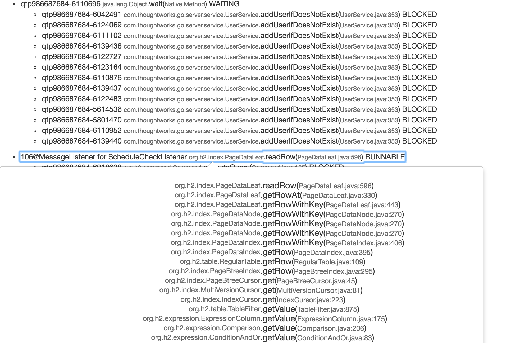

Parse a thread dump from the /api/support endpoint of [go](https://github.com/gocd/gocd).

Last I looked was produced by [ThreadInformationProvider](https://github.com/gocd/gocd/blob/master/server/src/com/thoughtworks/go/server/service/support/ThreadInformationProvider.java).

Used hunting performance troubles.

### Screenshot

Example from [go-log-12.txt](https://raw.githubusercontent.com/wcurrie/gocd-support/master/src/test/resources/gosupport2.txt)

